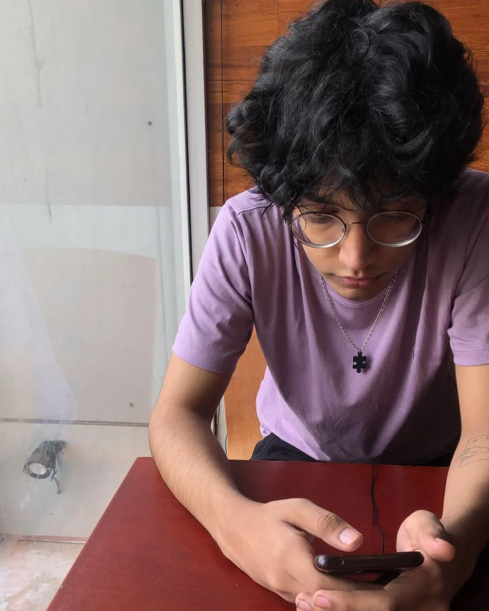

# Jatin Banga Personal Page

## Jatin Banga

Hi, As the overly obnoxious name of the webpage suggests, I'm ***Jatin Banga***, a 19 years old cisgendered male.  
Originally I'm from ***Delhi, India*** and am an undergraduate student pursuing engineering in Mathematics and Computing from IIT Goa.  
Some of my hobbies include reading, playing y/n story games, watching Football, and most importantly consuming media in both forms music and cinema.

### Education

| Year of Graduation | Degree         | Institution | 
|--------------------|----------------|-------------|
| 2025               | Btech          | IIT Goa     |
| 2021               | 12th Standard  | CBSE        |
| 2019               | 10th Standard  | CBSE        | 

#### First Year Courses @ IIT Goa

##### Autumn 2021-22 #####
- **CS101**: Introduction to Computing by *Dr. Clint P. George*
- **MTH101**: Calculus by *Dr. Sandipan De*
- **CH102**: Inorganic and Organic Chemistry by *Dr. Rishikesh Narayan*
- **CH101**: Physical Chemistry by *Dr. Mantu Santra*
- **PH101**: Quantum Physics by *Dr. Santosh Das*
- **HS101**: Humanities and Social Sciences by *Dr. Sabiha Hashami*
- **CH104**: Chemistry Lab by *Dr. E. Siva S Iyer*

##### Spring 2021-22 #####
1. *CS102*: Software Tools by <u>Dr. Clint P. George</u>   [Course Link](https://clintpgeorge.github.io/cs-102/spring-2022/)
2. *MTH1021*: Linear Algebra by <u>Dr. Kalpesh Haria</u>  [Course Link](https://iitgoa.ac.in/wp-content/uploads/InstituteCoreCourses-MnC2021.pdf)
3. *MTH1022*: Differential Equations by <u>Dr. Soumya Bajpai</u>  [Course Link](https://iitgoa.ac.in/wp-content/uploads/InstituteCoreCourses-MnC2021.pdf)
4. *BIO101*: Introductory Biology by <u>Dr. Sreenath Balkrishan</u>  [Course Link](https://iitgoa.ac.in/wp-content/uploads/InstituteCoreCourses-MnC2021.pdf)
5. *PH102*: Electricity & Magnetism by <u>Dr. Vaibhav Wasnik</u>  [Course Link](https://iitgoa.ac.in/wp-content/uploads/InstituteCoreCourses-MnC2021.pdf)
6. *PH104*: Physics Lab by <u>Dr. Santosh Kumar</u>  [Course Link](https://iitgoa.ac.in/wp-content/uploads/InstituteCoreCourses-MnC2021.pdf)
7. *EE101*: Introduction to Electrical and Electronics Engineering by <u>Dr. Nandakumar Nambath</u>  [Course Link](https://iitgoa.ac.in/wp-content/uploads/InstituteCoreCourses-MnC2021.pdf)
8. *ME102*: Engineering Graphics by <u>Dr. Anirudha Ambekar</u>  [Course Link](https://iitgoa.ac.in/wp-content/uploads/InstituteCoreCourses-MnC2021.pdf)

#### Top 3 Spotify Artists
1. [Phoebe Bridgers](https://open.spotify.com/artist/1r1uxoy19fzMxunt3ONAkG)
2. [Elliott Smith](https://open.spotify.com/artist/2ApaG60P4r0yhBoDCGD8YG)
3. [Radiohead](https://open.spotify.com/artist/4Z8W4fKeB5YxbusRsdQVPb)

